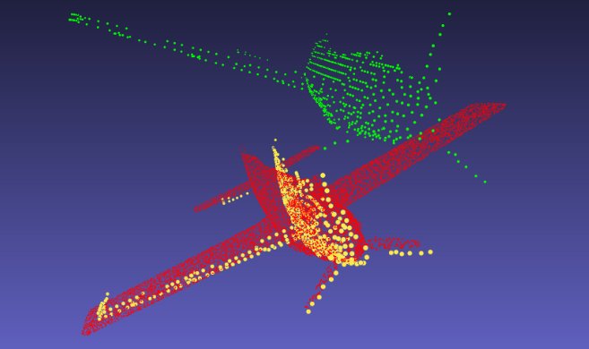

# Point Clouds Alignment with Incomplete Shapes
PCD Reconstruction and Registration for the ML3D course at TUM (2022)

<div  align="center">    

</div>

### [Report](.docs/report.pdf)
[Dan Halperin](https://github.com/DanHalp), [Manuel Coutinho](https://github.com/ManelCoutinho), Andrii Protas, Priya Arumugam

## Abstract

> Finding the affine transformation between two point clouds is an ongoing research work in computer vision and has applications in computer graphics, robotics, etc. Several powerful algorithms have been proposed for this purpose, such as the Iterative closest-points (ICP). However, it has been shown that they tend to converge to poor optima or saddle points. This project investigats the use of a deep learning approach, Deep-Closest Point (DCP), to solve the problem. However, in their work, it was found that the algorithm has difficulty aligning incomplete point clouds with corresponding shapes. We found that a simple solution is to perform transfer learning by extending the training set to handle incomplete shapes. In addition, we performed a comparison of the use of DCP and ICP on incomplete shapes and found promising results.

## Installation

<!-- TODO: setup conda env part -->
1. Create virtual environment via `conda`
```shell
   conda create -n [name] python=3.7
   conda activate [name]
```

2. Install pytorch
```shell
   pip install torch==1.12.0+cu113 -f https://download.pytorch.org/whl/cu113/torch_stable.html
```

3. Install requirements
```shell
   pip install -r requirements.txt
```

4. Install cuda
```shell
   sh setup_env.sh
```

## Folder structure

    .
    ├── ...
    ├── Configs
    │   └── pr_config.py         # Configuration file with model parameters
    ├── DCP                      # Folder for the DCP model
    ├── docs                     # Folder with the final paper and other resources
    ├── docs                     # Folder with the trained models
    ├── SpareNet                 # Folder for the SpareNet model
    └── README.md

## Datasets
Two different datasets were used:

1. ShapeNet: [download link](https://gateway.infinitescript.com/?fileName=ShapeNetCompletion) (16384 points) generated by [GRNet](https://github.com/hzxie/GRNet), and the [KITTI dataset](https://drive.google.com/drive/folders/1fSu0_huWhticAlzLh3Ejpg8zxzqO1z-F);
2. ModelNet40; [link](https://modelnet.cs.princeton.edu/)

Final folder structure:

    data
    ├── ModelNet40           # Original ModelNet DCP dataset
    └── ShapeNetCompletion   # ShapeNet dataset

## Run the model
To run the model simply configure the `pr_config.py` file (see folder structure) and run the main script by calling on the root:
```shell
   python main.py
```

You can select the model from the `model` folder.

# Example running configurations:
CFG.PROJECT.task = TASK.TEST
CFG.TRANSFORM.use_icp = FALSE
CFG.RECONSTRUCTION.output = "<outputdir>"
CFG.RECONSTRUCTION.local_dir = "<SpareNetMainDir>"
CFG.RECONSTRUCTION.model_path = "<SpareNetModelPath>"
CFG.TRANSFORM.model_path = MODELS_ORIG_OR_TRAIN[0]

Set your DCP modelpath in MODELS_ORIG_OR_TRAIN. Just follow the structure.


## Output folder structure
    Outputs
    ├── Orig                  # Folder with outputs for the original DCP
    │   ├── gtcloud           # Folder with full point cloud to full point cloud matches
    │   ├── partial_cloud     # Folder with partial point cloud to full point cloud matches 
    │   └── reconstructed     # Folder with reconstructed point cloud to full point cloud matches
    └── Trained               # Folder with outputs for the trained DCP
         └── ...              # Exact same folder structure as in Orig


## Bibliography

**DCP:** [PDF](https://arxiv.org/abs/1905.03304); [Code](https://github.com/WangYueFt/dcp)

**SpareNet:** [PDF](https://arxiv.org/abs/2103.02535); [Code](https://github.com/microsoft/SpareNet)
